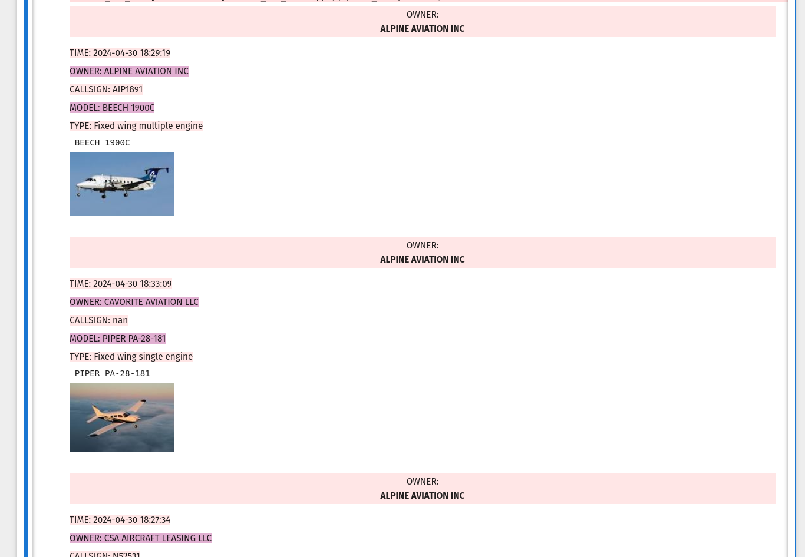
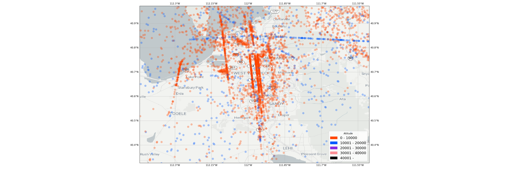
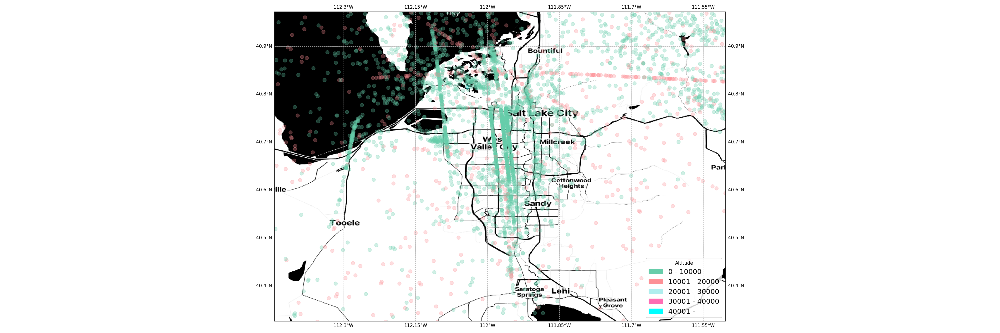
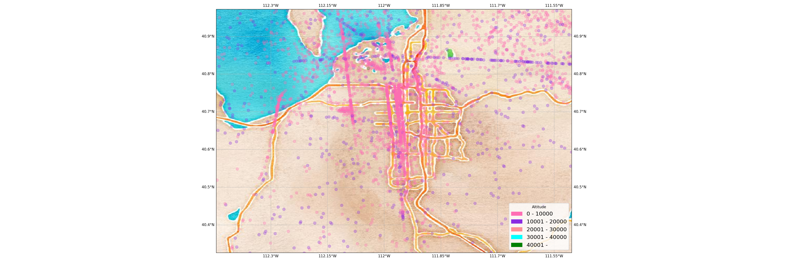
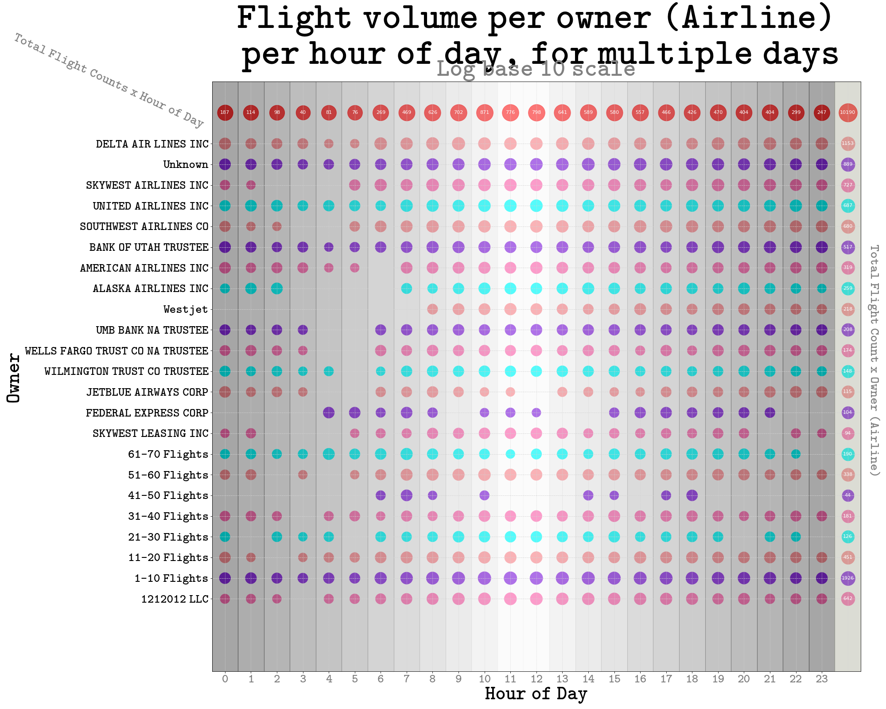

This Jupyter Notebook provides different classes to start interacting with .kismet files for ADSB records. 

# Setup:

The notebook expects two environment variables, I use Z shell, use ```.bashrc``` if you have bash:
```
echo 'export POSTGRES_PASSWORD="<YOUR PASSWORD>"'>~/.zshrc 
echo 'export STADIA_API_KEY="<YOUR API KEY"'>~/.zshrc
```

It's best to create a virtual environment for all the python requirements: 

```
python -m venv <dir>

source yourenv/bin/activate 
```

- install requirements.txt
  pip install -r requirements.txt

- have postgresql installed (see the ImageStorageAndRetrieval class for postgresql parameters)
- have a stadia API key from stadiamaps.com (this is technically  not needed as there is an OpenStreetMap option but Stadia has free options and their tiles looks so much better!)

- lots of kismet logs! (this expects the JSON version so use ```kismetdb_dump_devices --in <.kismet file> --out <file.json>```

The notebook expects the following folder structure:

"/home/\<USERNAME\>/logs/" < ---- folder where Ipynb notebook should live 

"home/\<USERNAME\>/logs/kismet/json" < --- folder where JSON converted .kismet files live

"home/\<USERNAME\>/logs/airplane-images" <---- folder where scraper downloads images to, if you wish to download a new random image, delete it here. 

# Description:

There is a web scraper that helps one get images of planes/helicopters in order to visualize the air traffic. 

There are a couple of functions to group the logs by either Owner, ICAO or time. 

There are some plotting functions to start gaining insight into a massive amount of logs, inlcuding a function that interacts with maps from stadia and allows one to 
download tiles for a bounding box and overlay information on top of the tiles! 

It is easy to create heatmaps to identify which areas have most air traffic, the ATC patterns planes use etc. 

With the time_scatter_plot function it is easy to compare the volume of flights per owner per hour of the day for multiple days. This allows one to answer questions like, which owner (airline) flies most at which hours? or which hours of the days have most flights? 

written by Salvador Gutierrez 

Stadia Maps: 


Visualize the air traffic around you!



Heatmaps of Air Traffic








In this plot we bin together all the flights in 10s until we get to Owners (Airlines) that have more than 100 flights in the window of time we explore (here it is from April 18 2024 - May 3 2024) 



